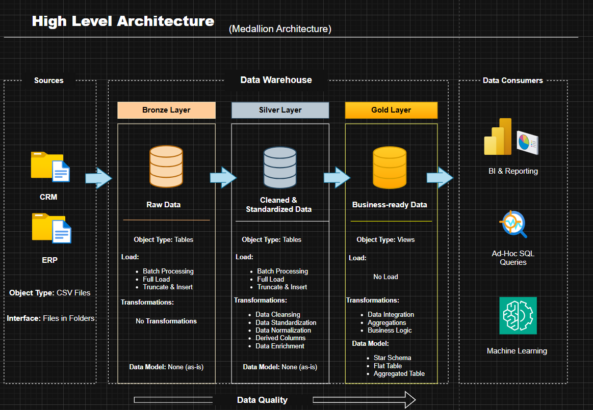

# 🏗️ End-to-End SQL Data Warehouse

A complete **end-to-end Data Warehouse project** built using SQL Server, implementing **ETL pipelines, Medallion Architecture, and Star Schema modeling** for analytics and reporting.

---

## 📌 Project Overview

This project demonstrates how to:

- Build a **modern Data Warehouse from scratch**
- Design **Medallion Architecture (Bronze, Silver, Gold)**
- Implement **ETL pipelines using SQL**
- Perform **data cleaning, transformation, and integration**
- Create a **business-ready analytical model (Star Schema)**
- Apply **data quality checks**


🎯 The goal is to transform raw CRM & ERP data into **trusted, analytics-ready datasets** for reporting and decision-making.

---

## 🏗️ Data Architecture

This project follows the **Medallion Architecture**, a standard approach in modern data engineering.

### 📊 Architecture Diagram



### 🔄 Architecture Flow

Sources (CRM, ERP CSV Files)  
↓  
Bronze Layer (Raw Data)  
↓  
Silver Layer (Cleaned & Standardized Data)  
↓  
Gold Layer (Business-Ready Data)  
↓  
Data Consumers (BI, SQL, ML)  

### 📌 Layers Overview

- **Bronze Layer:** Stores raw data from source systems with no transformations (full load).
- **Silver Layer:** Cleans, standardizes, and enriches data by handling nulls, duplicates, and inconsistencies.
- **Gold Layer:** Provides business-ready data modeled using a Star Schema for analytics and reporting.

---

## ⚙️ ETL Pipeline

The ETL process is implemented using **SQL Stored Procedures**:

### 🔹 Bronze Load
- Load raw CSV data into Bronze tables

### 🔹 Silver Load
- Clean, transform, and standardize data

### 🔹 Gold Layer
- Build analytical views (dimensions & fact tables)

---

## 📁 Project Structure

├── data_sources/
│   ├── source_crm/
│   └── source_erp/
├── docs/
├── scripts/
│   ├── bronze_layer/
│   ├── silver_layer/
│   └── gold_layer/
├── tests/
└── README.md

---

## ✅ Data Quality

Data quality checks are implemented to ensure:

- No NULL values in primary keys
- No duplicate records
- Valid relationships between tables
- Valid business rules (e.g., positive sales, valid dates)

---

## 🛠️ Technologies Used

- Microsoft SQL Server  
- Transact-SQL (T-SQL)  
- SQL Server Management Studio (SSMS)  
- draw.io  
- CSV Files  
- Star Schema Modeling  

---

## 🚀 How to Run the Project

1. Create the database:
```sql
CREATE DATABASE DataWarehouse;
EXEC bronze.load_bronze;
EXEC silver.load_silver;
