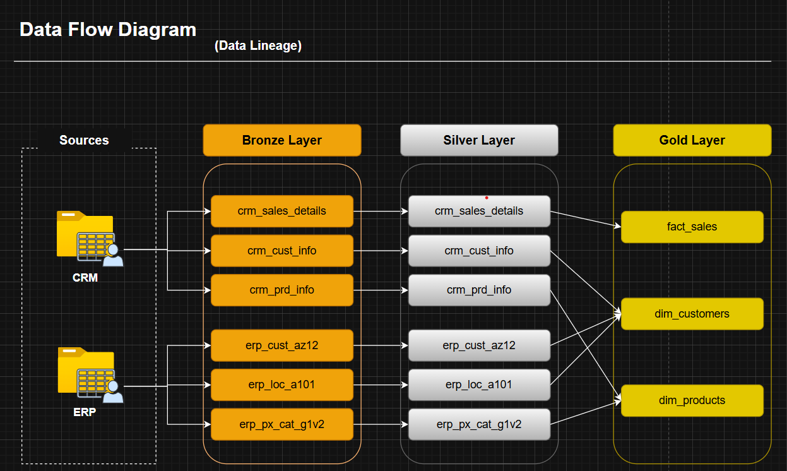
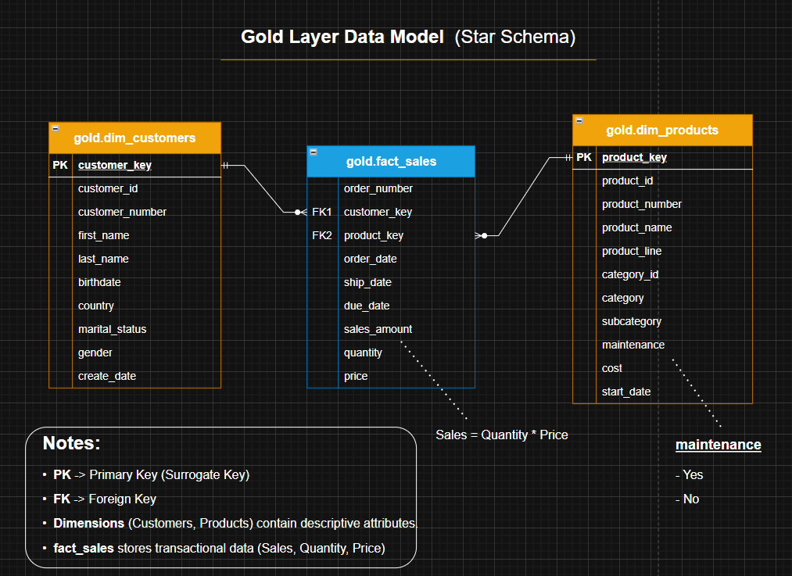

# 🏗️ End-to-End SQL Data Warehouse & Analytics

A complete **end-to-end Data Warehouse project** built with SQL Server, implementing **ETL pipelines, Medallion Architecture, and Star Schema modeling** for analytics.

---

## 📌 Problem & Overview

In many organizations, data from CRM and ERP systems is fragmented, inconsistent, and difficult to analyze. This project addresses that challenge by transforming raw data into **clean, structured, and analytics-ready datasets**.

### 🎯 Goal:

- Build a **modern data warehouse end-to-end**
- Design **Medallion Architecture (Bronze → Silver → Gold)**
- Develop **ETL pipelines using SQL**
- Perform **data cleaning, transformation, and integration**
- Create a **business-ready analytical model (Star Schema)**
- Apply **data quality checks**

---

## 🏗️ Data Architecture

This project follows the **Medallion Architecture**, a standard approach in modern data engineering.

### 📊 Architecture Diagram


### 🔄 Architecture Flow

Sources (CRM, ERP CSV Files)  
↓  
Bronze Layer (Raw Data)  
↓  
Silver Layer (Cleaned & Standardized Data)  
↓  
Gold Layer (Business-Ready Data)  
↓  
Data Consumers (BI, SQL, ML)  

### 📌 Layers Overview

- **Bronze Layer:** Stores raw data from source systems with no transformations (full load).
- **Silver Layer:** Cleans, standardizes, and enriches data by handling nulls, duplicates, and inconsistencies.
- **Gold Layer:** Provides business-ready data modeled using a Star Schema for analytics and reporting.

---

## ⚙️ ETL Pipeline

The ETL process is implemented using **SQL Stored Procedures**:

### 🔹 Bronze Load
- Load raw CSV data into Bronze tables

### 🔹 Silver Load
- Clean, transform, and standardize data

### 🔹 Gold Layer
- Build analytical views (dimensions & fact tables)

### 🔄 Data Flow



---

## 📐 Data Modeling

This project implements a **dimensional data modeling approach** using a **Star Schema** design in the Gold layer to support efficient analytical queries and reporting.

### ⭐ Star Schema Design

The **Gold layer** is structured as a **Star Schema**, consisting of:

#### 🔹 Fact Table

- `fact_sales`
  - Contains transactional (measurable) data
  - Represents business events (e.g., sales transactions)
  - Stores key metrics such as:
    - `sales_amount`
    - `quantity`
    - `revenue`

#### 🔹 Dimension Tables

- `dim_customers` → stores customer information
- `dim_products` → stores product details

### Data Model



---

## 📊 Analytics & Insights

An **analytics layer** was built using SQL to perform **Exploratory Data Analysis (EDA)** and generate business insights.

### 🔍 Analysis Includes:

- Data profiling & quality checks  
- KPI calculations (Revenue, Orders, AOV)  
- Customer segmentation (High / Medium / Low value)  
- Product performance analysis  
- Revenue distribution by category  
- Time-based trends (monthly/yearly)  

👉 See full insights:  
`scripts/04_analytics/insights.md`

---

## 📁 Project Structure

```text
├── data_sources/
│   ├── source_crm/
│   └── source_erp/
├── docs/
├── scripts/
│   ├── 01_bronze_layer/
│   ├── 02_silver_layer/
|   ├── 03_gold_layer/
│   └── 04_analytics/
├── tests/
└── README.md
```

---

## ✅ Data Quality

Data quality checks are implemented to ensure:

- No NULL values in primary keys
- No duplicate records
- Valid relationships between tables
- Valid business rules (e.g., positive sales, valid dates)

---

## 🧰 Tech Stack

- Microsoft SQL Server  
- Transact-SQL (T-SQL)  
- SQL Server Management Studio (SSMS)  
- draw.io  
- CSV

---

## 🚀 How to Run the Project

```sql
CREATE DATABASE DataWarehouse;
EXEC bronze.sp_load_bronze_layer;
EXEC silver.sp_load_silver_layer;
