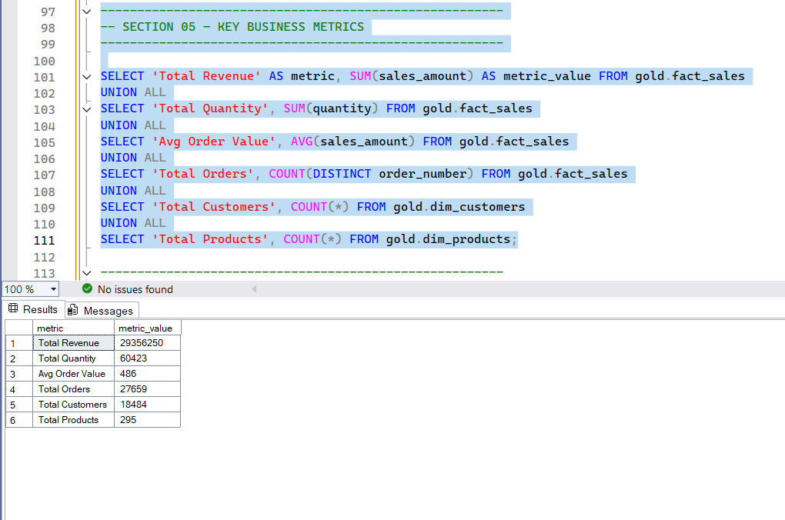
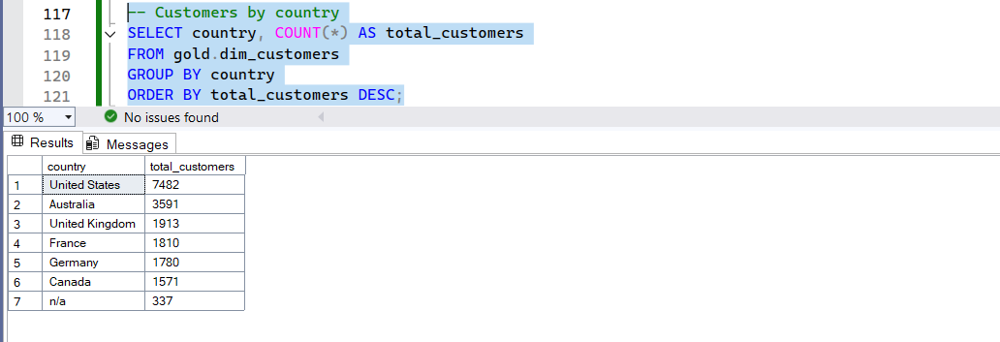
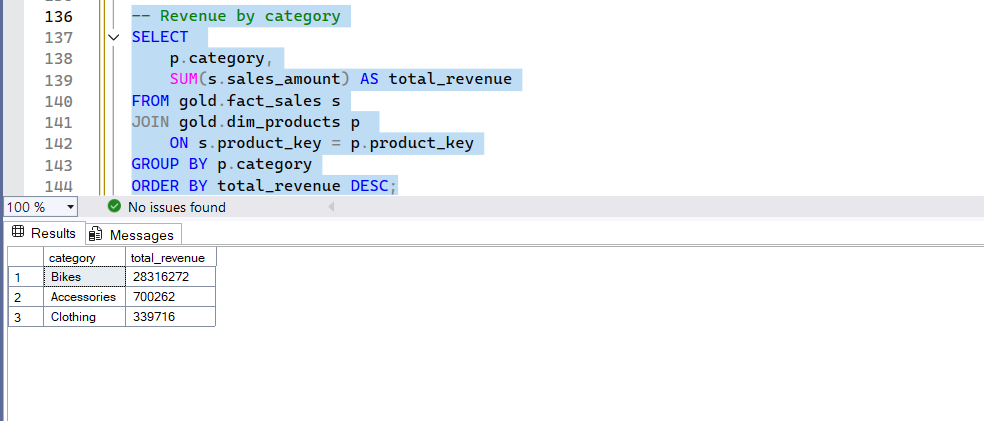
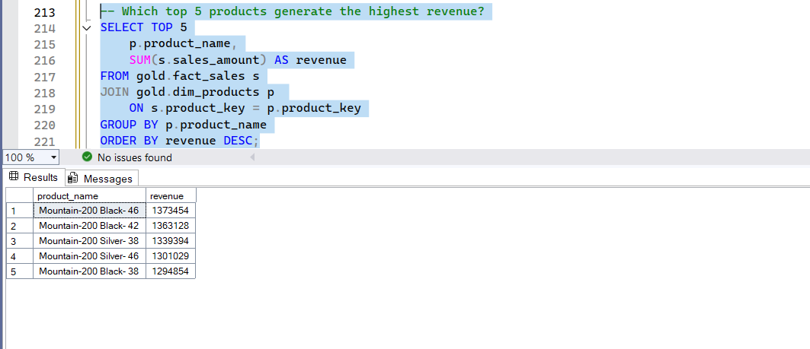
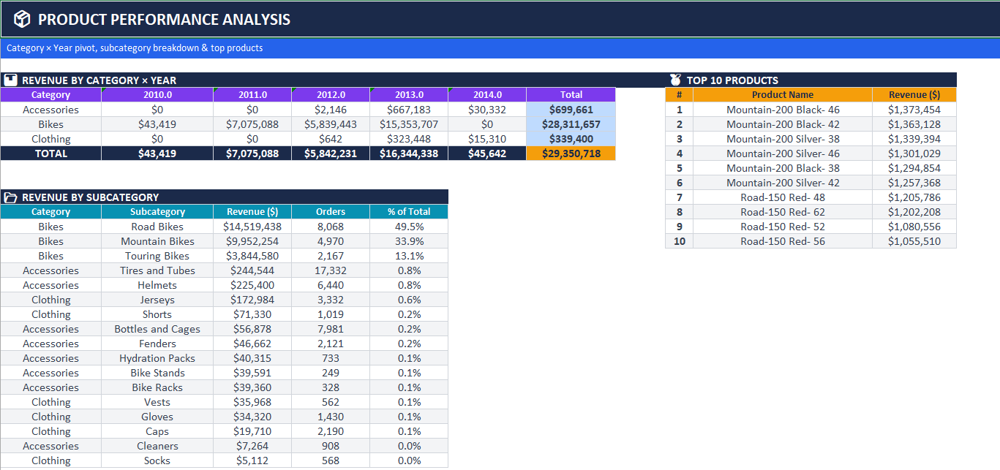

# 📊 Analytics Insights

## 🧾 Overview
This document summarizes the key insights derived from the exploratory data analysis (EDA) performed on the **Gold layer** of the data warehouse.

The analysis focuses on **customers, products, and sales** to uncover patterns, trends, and actionable business insights.

---

## 🔍 Data Profiling & Quality Checks

- Explored all tables in the Gold schema and validated row counts.
- Previewed datasets to understand structure and relationships.
- Checked **data quality issues**.

---

## 🌍 Customer Insights

- Customers are distributed across multiple countries, with a few countries dominating the dataset.
- Gender distribution varies, enabling demographic-based segmentation.
- Customer age ranges indicate a **diverse customer base**, supporting multiple market segments.

---

## 📦 Product Insights

- Products are structured into **categories and subcategories**, allowing detailed analysis.
- Some categories contain significantly more products, suggesting broader offerings and potential focus areas.

---

## 💰 Sales & KPI Insights

Key business metrics identified:

- **Total Revenue**
- **Total Quantity Sold**
- **Average Order Value**
- **Total Orders**
- **Total Customers & Products**

👉 The dataset supports **end-to-end KPI tracking**, making it ready for reporting and dashboarding.

---

## 📊 Magnitude Analysis

- A small number of countries contribute the majority of customers.
- Revenue is **unevenly distributed across categories**, with top categories driving most sales.
- Customer spending is highly skewed, where a small segment generates a large portion of revenue.

---

## 📈 Time-Based Insights

- Sales data spans multiple years, enabling trend and seasonality analysis.
- Revenue trends show fluctuations that may indicate:
  - Seasonal demand patterns
  - Growth or decline phases

---

## 🧑‍💼 Customer Behavior Insights

- A small percentage of customers is responsible for the **highest revenue contribution**.
- Customer segmentation reveals:
  - High-value customers (top spenders)
  - Medium-value customers
  - Low-value customers (majority)

👉 This emphasizes the importance of **customer retention and targeted marketing strategies**.

---

## 🏆 Product Performance Insights

- The **top-performing products** generate a significant share of total revenue.
- The **lowest-performing products** contribute minimal value and may require:
  - Marketing optimization
  - Pricing adjustments
  - Potential discontinuation

---

## 🖼️ Key Visual Insights

### 💰 Business KPIs

👉 Provides a high-level overview of revenue, orders, and customer activity.

---

### 🌍 Customers by Country

👉 Highlights key geographic markets driving customer base.

---

### 📦 Revenue by Category

👉 Shows which product categories contribute most to revenue.

---

### 🏆 Top Products

👉 Identifies best-performing products by revenue.

---

## 🎯 Key Business Findings

- Bikes account for 96.5% of total revenue — Accessories and Clothing are negligible
- Road Bikes alone represent 49.5% of all revenue, making it the single most critical subcategory
- Top 10 products contribute 42.5% of total revenue
- Top 20% of customers generate 66.4% of total revenue
- US and Australia together drive 62.1% of revenue at ~$9M each
- Revenue grew 180% in 2013 ($5.8M → $16.3M) — the cause behind this spike is unknown and worth investigating

---

### 📊 Product Dashboard

